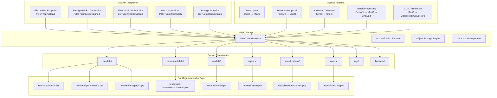
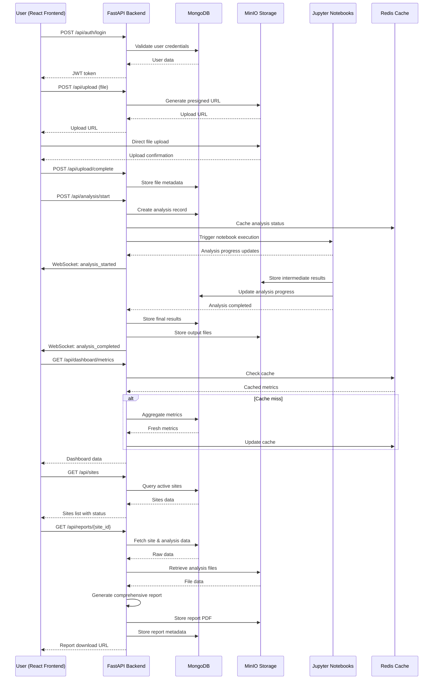

# AI Rockfall Prediction System - Complete Architecture Flow Chart

## System Overview with MongoDB, MinIO & FastAPI

```mermaid
graph TB
    subgraph "Data Sources & Input"
        A1[LiDAR .las files<br/>Point Cloud Data]
        A2[Geophone CSV<br/>Seismic Data]
        A3[Piezometer CSV<br/>Pressure Data]
        A4[GB-InSAR CSV<br/>Displacement Data]
        A5[Extensometer CSV<br/>Deformation Data]
        A6[Weather Station CSV<br/>Environmental Data]
        A7[YOLO Images<br/>Visual Data]
        A8[Rockfall Incidents<br/>Historical Data]
    end

    subgraph "FastAPI Backend Layer"
        FA1[FastAPI Application<br/>Main Server]
        FA2[Authentication Middleware<br/>JWT Tokens]
        FA3[CORS Middleware<br/>Frontend Integration]
        FA4[WebSocket Manager<br/>Real-time Updates]
        FA5[Background Tasks<br/>Async Processing]
    end

    subgraph "API Endpoints (FastAPI)"
        E1[POST /api/upload<br/>File Upload]
        E2[GET /api/sites<br/>Sites Management]
        E3[GET /api/dashboard<br/>Metrics & KPIs]
        E4[POST /api/analysis/start<br/>Trigger Analysis]
        E5[GET /api/reports/{id}<br/>Generate Reports]
        E6[WebSocket /ws/updates<br/>Live Updates]
        E7[GET /api/devices<br/>Device Management]
        E8[POST /api/auth/login<br/>User Authentication]
    end

    subgraph "MongoDB Database Layer"
        M1[Users Collection<br/>Authentication & Profiles]
        M2[Sites Collection<br/>Mining Locations & Config]
        M3[Devices Collection<br/>Sensor Metadata & Status]
        M4[Analyses Collection<br/>Analysis Runs & Results]
        M5[Alerts Collection<br/>System Notifications]
        M6[Reports Collection<br/>Generated Reports]
        M7[Metrics Collection<br/>Performance Data]
        M8[AuditLogs Collection<br/>System Activity]
    end

    subgraph "MinIO Object Storage"
        S1[Raw Data Bucket<br/>Original Sensor Files]
        S2[Processed Data Bucket<br/>Analysis Outputs]
        S3[Models Bucket<br/>Trained ML Models]
        S4[Reports Bucket<br/>PDF & JSON Reports]
        S5[Visualizations Bucket<br/>Charts & Images]
        S6[Rasters Bucket<br/>Geospatial Maps]
        S7[Logs Bucket<br/>Processing Logs]
        S8[Backups Bucket<br/>System Backups]
    end

    subgraph "Analysis Engine (Jupyter)"
        J1[LiDAR_Analysis.ipynb<br/>3D Point Cloud Processing]
        J2[Geophone_Analysis.ipynb<br/>Seismic Signal Analysis]
        J3[Piezometer_Analysis.ipynb<br/>Pressure Monitoring]
        J4[GB_InSAR_Analysis.ipynb<br/>Ground Displacement]
        J5[Extensometer_Analysis.ipynb<br/>Deformation Tracking]
        J6[Weather_Analysis.ipynb<br/>Environmental Correlation]
        J7[YOLO_Analysis.ipynb<br/>Computer Vision]
        J8[Data_Fusion.ipynb<br/>Multi-sensor Integration]
    end

    subgraph "Processing Pipeline"
        P1[Data Ingestion<br/>Validation & Preprocessing]
        P2[Feature Engineering<br/>38+ Features Extraction]
        P3[ML Model Inference<br/>Random Forest, XGBoost]
        P4[Risk Calculation<br/>Probability Scoring]
        P5[Result Aggregation<br/>Multi-sensor Fusion]
        P6[Alert Generation<br/>Threshold-based Warnings]
    end

    subgraph "Frontend Dashboard (React)"
        F1[Authentication System<br/>Login/Registration]
        F2[Main Dashboard<br/>Real-time Metrics]
        F3[Sites Management<br/>Active Processing View]
        F4[Device Management<br/>Sensor Configuration]
        F5[Analysis Interface<br/>Trigger & Monitor]
        F6[Reports & Analytics<br/>Comprehensive Reports]
        F7[Real-time Alerts<br/>Notification System]
        F8[User Profile<br/>Settings & Preferences]
    end

    subgraph "External Integrations"
        X1[Mining Control Systems<br/>MineSight, Surpac]
        X2[IoT Sensor Networks<br/>Real-time Data Streams]
        X3[Cloud Services<br/>Azure/AWS Deployment]
        X4[Notification Services<br/>Email/SMS Alerts]
        X5[Weather APIs<br/>External Data Sources]
        X6[GIS Systems<br/>Geospatial Integration]
    end

    A1 --> E1
    A2 --> E1
    A3 --> E1
    A4 --> E1
    A5 --> E1
    A6 --> E1
    A7 --> E1
    A8 --> E1

    E1 --> FA1
    E2 --> FA1
    E3 --> FA1
    E4 --> FA1
    E5 --> FA1
    E6 --> FA1
    E7 --> FA1
    E8 --> FA1

    FA1 --> FA2
    FA1 --> FA3
    FA1 --> FA4
    FA1 --> FA5

    FA1 --> M1
    FA1 --> M2
    FA1 --> M3
    FA1 --> M4
    FA1 --> M5
    FA1 --> M6
    FA1 --> M7
    FA1 --> M8

    FA1 --> S1
    FA1 --> S2
    FA1 --> S3
    FA1 --> S4
    FA1 --> S5
    FA1 --> S6
    FA1 --> S7
    FA1 --> S8

    E4 --> J1
    E4 --> J2
    E4 --> J3
    E4 --> J4
    E4 --> J5
    E4 --> J6
    E4 --> J7

    J1 --> P1
    J2 --> P1
    J3 --> P1
    J4 --> P1
    J5 --> P1
    J6 --> P1
    J7 --> P1

    P1 --> P2
    P2 --> P3
    P3 --> P4
    P4 --> P5
    P5 --> P6

    P6 --> M4
    P6 --> M5
    P5 --> S2
    P5 --> S3
    P5 --> S4
    P5 --> S5
    P5 --> S6
    P5 --> S7

    E3 --> F2
    E2 --> F3
    E7 --> F4
    E4 --> F5
    E5 --> F6
    FA4 --> F7
    E8 --> F1

    F6 --> X1
    FA1 --> X2
    FA1 --> X3
    P6 --> X4
    J6 --> X5
    P5 --> X6
```

## ASCII Art Data Flow Diagram

```
┌─────────────────┐    ┌─────────────────┐    ┌─────────────────┐
│   Data Sources  │    │   FastAPI       │    │   MongoDB       │
│                 │    │   Backend       │    │   Database      │
│ • LiDAR .las    │───▶│ • File Upload   │───▶│ • Users         │
│ • Geophone CSV  │    │ • Validation    │    │ • Sites         │
│ • Piezometer    │    │ • Processing    │    │ • Devices       │
│ • GB-InSAR      │    │ • WebSocket     │    │ • Analyses      │
│ • Images        │    │                 │    │ • Alerts        │
└─────────────────┘    └─────────────────┘    └─────────────────┘
         │                        │                        │
         ▼                        ▼                        ▼
┌─────────────────┐    ┌─────────────────┐    ┌─────────────────┐
│   MinIO         │    │ Analysis Engine │    │   Frontend      │
│   Storage       │    │                 │    │   Dashboard     │
│ • Raw Data      │◀───│ • Jupyter       │───▶│ • Real-time     │
│ • Processed     │    │ • Orchestration │    │ • Metrics       │
│ • Models        │    │ • ML Models     │    │ • Charts        │
│ • Reports       │    │ • Risk Scoring  │    │ • Alerts        │
└─────────────────┘    └─────────────────┘    └─────────────────┘
         ▲                        │                        │
         │                        ▼                        │
┌─────────────────┐    ┌─────────────────┐    ┌─────────────────┐
│  External APIs  │    │   Results       │    │   User Actions  │
│                 │    │   Processing    │    │                 │
│ • Weather APIs  │───▶│ • Data Fusion   │◀───│ • Upload Files  │
│ • Mining Systems│    │ • Aggregation   │    │ • Start Analysis│
│ • IoT Networks  │    │ • Reports       │    │ • View Reports  │
└─────────────────┘    └─────────────────┘    └─────────────────┘
```

## Detailed Component Flow

```
INPUT DATA FLOW:
Sensor Data ──▶ FastAPI Upload ──▶ MinIO Storage ──▶ Analysis Queue ──▶ Jupyter Processing

PROCESSING FLOW:
Raw Files ──▶ Validation ──▶ Preprocessing ──▶ Feature Extraction ──▶ ML Models ──▶ Risk Scoring

STORAGE FLOW:
Results ──▶ MongoDB Documents ──▶ MinIO Files ──▶ Cache Layer ──▶ API Responses

OUTPUT FLOW:
Risk Scores ──▶ Alert Generation ──▶ WebSocket Broadcast ──▶ Dashboard Updates ──▶ User Notifications

REPORT FLOW:
Analysis Data ──▶ Data Aggregation ──▶ Report Generation ──▶ PDF Creation ──▶ MinIO Storage ──▶ Download URLs
```

## System Architecture Box Diagram

```
+-----------------------------------------------------------------------------------+
|                            AI ROCKFALL PREDICTION SYSTEM                          |
+-----------------------------------------------------------------------------------+
|                                                                                   |
|  ┌─────────────────────────────────────────────────────────────────────────────┐  |
|  │                          FRONTEND LAYER (React)                             │  |
|  │  ┌─────────────┐ ┌─────────────┐ ┌─────────────┐ ┌─────────────┐           │  |
|  │  │  Dashboard  │ │   Sites     │ │  Devices   │ │  Reports    │           │  |
|  │  │  • Metrics  │ │  • Active   │ │  • Config  │ │  • PDF      │           │  |
|  │  │  • Charts   │ │  • Status   │ │  • Monitor │ │  • Analysis │           │  |
|  │  └─────────────┘ └─────────────┘ └─────────────┘ └─────────────┘           │  |
|  └─────────────────────────────────────────────────────────────────────────────┘  |
|                                                                                   |
|  ┌─────────────────────────────────────────────────────────────────────────────┐  |
|  │                         FASTAPI BACKEND LAYER                               │  |
|  │  ┌─────────────┐ ┌─────────────┐ ┌─────────────┐ ┌─────────────┐           │  |
|  │  │  Auth API   │ │  Upload API │ │ Analysis API│ │ Report API  │           │  |
|  │  │  • JWT      │ │  • Files    │ │  • Trigger  │ │  • Generate │           │  |
|  │  │  • Users    │ │  • MinIO    │ │  • Monitor  │ │  • Download │           │  |
|  │  └─────────────┘ └─────────────┘ └─────────────┘ └─────────────┘           │  |
|  └─────────────────────────────────────────────────────────────────────────────┘  |
|                                                                                   |
|  ┌─────────────────────────────────────────────────────────────────────────────┐  |
|  │                         DATABASE LAYER                                      │  |
|  │  ┌─────────────┐ ┌─────────────┐ ┌─────────────┐ ┌─────────────┐           │  |
|  │  │  MongoDB    │ │   MinIO     │ │   Redis     │ │   Celery    │           │  |
|  │  │  • Documents│ │  • Objects  │ │  • Cache    │ │  • Tasks    │           │  |
|  │  │  • Queries  │ │  • Files    │ │  • Sessions │ │  • Queue    │           │  |
|  │  └─────────────┘ └─────────────┘ └─────────────┘ └─────────────┘           │  |
|  └─────────────────────────────────────────────────────────────────────────────┘  |
|                                                                                   |
|  ┌─────────────────────────────────────────────────────────────────────────────┐  |
|  │                         ANALYSIS ENGINE                                      │  |
|  │  ┌─────┐ ┌─────┐ ┌─────┐ ┌─────┐ ┌─────┐ ┌─────┐ ┌─────┐ ┌─────┐           │  |
|  │  │ LiDAR│ │Geo  │ │Piezo│ │GB   │ │Ext  │ │Weath│ │YOLO │ │Fusion│           │  |
|  │  │Proc  │ │phone│ │meter│ │InSAR│ │enso │ │er   │ │Vis  │ │Engine│           │  |
|  │  └─────┘ └─────┘ └─────┘ └─────┘ └─────┘ └─────┘ └─────┘ └─────┘           │  |
|  └─────────────────────────────────────────────────────────────────────────────┘  |
|                                                                                   |
|  ┌─────────────────────────────────────────────────────────────────────────────┐  |
|  │                         EXTERNAL INTEGRATIONS                               │  |
|  │  ┌─────────────┐ ┌─────────────┐ ┌─────────────┐ ┌─────────────┐           │  |
|  │  │ Mining Ctrl │ │ IoT Sensors │ │ Cloud Svcs │ │ Weather APIs│           │  |
|  │  │ • MineSight │ │ • Real-time │ │ • Azure/AWS │ │ • External  │           │  |
|  │  │ • Surpac    │ │ • Streaming │ │ • Storage   │ │ • Data      │           │  |
|  │  └─────────────┘ └─────────────┘ └─────────────┘ └─────────────┘           │  |
|  └─────────────────────────────────────────────────────────────────────────────┘  |
+-----------------------------------------------------------------------------------+
```

## Data Processing Pipeline Flow

```
START: Sensor Data Collection
       │
       ▼
┌─────────────────────────────┐
│     1. DATA INGESTION       │
│  • File validation          │
│  • Format checking          │
│  • Metadata extraction      │
└─────────────────────────────┘
       │
       ▼
┌─────────────────────────────┐
│     2. PREPROCESSING        │
│  • Data cleaning            │
│  • Normalization            │
│  • Outlier removal          │
└─────────────────────────────┘
       │
       ▼
┌─────────────────────────────┐
│     3. FEATURE ENGINEERING  │
│  • 38+ LiDAR features       │
│  • Time series features     │
│  • Statistical features     │
└─────────────────────────────┘
       │
       ▼
┌─────────────────────────────┐
│     4. ML MODEL INFERENCE   │
│  • Random Forest            │
│  • Gradient Boosting        │
│  • Ensemble methods         │
└─────────────────────────────┘
       │
       ▼
┌─────────────────────────────┐
│     5. RISK ASSESSMENT      │
│  • Probability scoring      │
│  • Risk level classification│
│  • Confidence intervals     │
└─────────────────────────────┘
       │
       ▼
┌─────────────────────────────┐
│     6. RESULT AGGREGATION   │
│  • Multi-sensor fusion      │
│  • Weighted averaging       │
│  • Consensus scoring        │
└─────────────────────────────┘
       │
       ▼
┌─────────────────────────────┐
│     7. OUTPUT GENERATION    │
│  • JSON reports             │
│  • Visualization files      │
│  • Alert notifications      │
└─────────────────────────────┘
       │
       ▼
END: Dashboard Updates & Reports
```

## Component Interaction Matrix

```
INTERACTION MATRIX:
┌─────────────┬─────────────┬─────────────┬─────────────┬─────────────┐
│ Component   │ Frontend    │ FastAPI     │ MongoDB     │ MinIO       │
├─────────────┼─────────────┼─────────────┼─────────────┼─────────────┤
│ Frontend    │      -      │ HTTP/WS     │     -       │ Direct Up   │
│ FastAPI     │ HTTP/WS     │      -      │ CRUD Ops    │ File Ops    │
│ MongoDB     │     -       │ CRUD Ops    │      -      │     -       │
│ MinIO       │ Direct Down │ File Ops    │     -       │      -       │
│ Jupyter     │     -       │ API Calls   │ Results     │ File I/O    │
│ Redis       │     -       │ Cache Ops   │     -       │     -       │
│ Celery      │     -       │ Task Queue  │ Status      │ File Proc   │
└─────────────┴─────────────┴─────────────┴─────────────┴─────────────┘

LEGEND:
- HTTP/WS: HTTP requests + WebSocket
- CRUD Ops: Create/Read/Update/Delete operations
- File Ops: Upload/Download/Delete operations
- Direct Up/Down: Direct file transfers
- API Calls: REST API communication
- Results: Data storage operations
- File I/O: File system operations
- Cache Ops: Cache read/write
- Task Queue: Asynchronous task submission
- Status: Progress tracking
- File Proc: Background file processing
```

## Real-time Data Flow

```
REAL-TIME COMMUNICATION FLOW:

User Action ──▶ React Component ──▶ Axios Request ──▶ FastAPI Route
       │                │                    │               │
       │                │                    │               │
       ▼                ▼                    ▼               ▼
WebSocket     State Update     HTTP Response    Business Logic
Broadcast     Re-render        JSON Data        Processing
       ▲                ▲                    ▲               ▲
       │                │                    │               │
       │                │                    │               │
Live Updates ◀── UI Refresh ◀─── Data Stream ◀─── Database Query
From Server     Dashboard       To Frontend      MongoDB/Redis
```

## Error Handling & Recovery Flow

```
ERROR HANDLING WORKFLOW:

Error Occurs ──▶ Exception Caught ──▶ Error Logging ──▶ Fallback Logic
       │                │                    │               │
       │                │                    │               │
       ▼                ▼                    ▼               ▼
User Alert     Error Response   Database Log    Recovery Action
Notification   HTTP 4xx/5xx     Error Details    Retry/Alternative
       ▲                ▲                    ▲               ▲
       │                │                    │               │
       │                │                    │               │
UI Feedback ◀─── Error Display ◀─── Log Analysis ◀─── System Recovery
Toast/Snack     Error Boundary    Monitoring      Auto-healing
```

## MongoDB Schema Architecture

```mermaid
graph TD
    subgraph "Users Collection"
        U1[user_id: ObjectId]
        U2[username: String (unique)]
        U3[email: String (unique)]
        U4[hashed_password: String]
        U5[role: String (admin/operator/viewer)]
        U6[is_active: Boolean]
        U7[created_at: DateTime]
        U8[updated_at: DateTime]
        U9[permissions: Array]
    end

    subgraph "Sites Collection"
        S1[site_id: ObjectId]
        S2[name: String]
        S3[description: String]
        S4[location: GeoJSON Point]
        S5[area_sqkm: Number]
        S6[mining_type: String]
        S7[status: String]
        S8[configuration: Object]
        S9[created_by: ObjectId (ref Users)]
        S10[created_at: DateTime]
        S11[device_count: Number]
        S12[last_analysis: DateTime]
    end

    subgraph "Devices Collection"
        D1[device_id: ObjectId]
        D2[name: String]
        D3[device_type: String]
        D4[site_id: ObjectId (ref Sites)]
        D5[location: GeoJSON Point]
        D6[status: String]
        D7[specifications: Object]
        D8[configuration: Object]
        D9[last_calibration: DateTime]
        D10[created_at: DateTime]
        D11[data_frequency: String]
        D12[alert_thresholds: Object]
    end

    subgraph "Analyses Collection"
        AN1[analysis_id: ObjectId]
        AN2[site_id: ObjectId (ref Sites)]
        AN3[device_ids: Array[ObjectId]]
        AN4[analysis_type: String]
        AN5[status: String]
        AN6[parameters: Object]
        AN7[results: Object]
        AN8[risk_score: Number]
        AN9[risk_level: String]
        AN10[execution_time: Number]
        AN11[input_files: Array[ObjectId]]
        AN12[output_files: Array[ObjectId]]
        AN13[created_by: ObjectId (ref Users)]
        AN14[started_at: DateTime]
        AN15[completed_at: DateTime]
        AN16[error_message: String]
    end

    subgraph "Alerts Collection"
        AL1[alert_id: ObjectId]
        AL2[site_id: ObjectId (ref Sites)]
        AL3[analysis_id: ObjectId (ref Analyses)]
        AL4[title: String]
        AL5[message: String]
        AL6[severity: String]
        AL7[alert_type: String]
        AL8[is_acknowledged: Boolean]
        AL9[acknowledged_by: ObjectId (ref Users)]
        AL10[acknowledged_at: DateTime]
        AL11[metadata: Object]
        AL12[created_at: DateTime]
    end

    subgraph "Reports Collection"
        R1[report_id: ObjectId]
        R2[site_id: ObjectId (ref Sites)]
        R3[analysis_ids: Array[ObjectId]]
        R4[report_type: String]
        R5[title: String]
        R6[summary: Object]
        R7[sections: Array[Object]]
        R8[file_url: String (MinIO)]
        R9[generated_by: ObjectId (ref Users)]
        R10[created_at: DateTime]
        R11[expires_at: DateTime]
    end

    subgraph "Metrics Collection"
        M1[metric_id: ObjectId]
        M2[metric_type: String]
        M3[value: Number]
        M4[unit: String]
        M5[site_id: ObjectId (ref Sites)]
        M6[device_id: ObjectId (ref Devices)]
        M7[tags: Object]
        M8[timestamp: DateTime]
        M9[metadata: Object]
    end
```

## MinIO Bucket Structure & FastAPI Integration



## FastAPI Endpoint Architecture

```mermaid
graph TB
    subgraph "Core FastAPI Application"
        APP[FastAPI()<br/>main.py]
        LIFESPAN[Lifespan Events<br/>startup/shutdown]
        MIDDLEWARE[CORS, Auth, Logging<br/>Middleware Stack]
    end

    subgraph "Router Modules"
        AUTH[auth.py<br/>Authentication Routes]
        SITES[sites.py<br/>Site Management]
        DEVICES[devices.py<br/>Device Management]
        ANALYSIS[analysis.py<br/>Analysis Orchestration]
        REPORTS[reports.py<br/>Report Generation]
        DASHBOARD[dashboard.py<br/>Metrics & KPIs]
        FILES[files.py<br/>MinIO Integration]
        WS[websocket.py<br/>Real-time Updates]
    end

    subgraph "Business Logic Services"
        AUTH_SVC[AuthService<br/>JWT, Password Hashing]
        SITE_SVC[SiteService<br/>CRUD Operations]
        DEVICE_SVC[DeviceService<br/>Sensor Management]
        ANALYSIS_SVC[AnalysisService<br/>Jupyter Orchestration]
        REPORT_SVC[ReportService<br/>PDF Generation]
        METRICS_SVC[MetricsService<br/>Aggregation Pipeline]
        STORAGE_SVC[StorageService<br/>MinIO Client]
        WS_SVC[WebSocketService<br/>Real-time Broadcasting]
    end

    subgraph "Data Access Layer"
        MONGO[MongoDB Client<br/>Motor Async Driver]
        MINIO[MinIO Client<br/>boto3/aioboto3]
        REDIS[Redis Client<br/>Cache & Sessions]
        CACHE[Cache Manager<br/>Response Caching]
    end

    subgraph "Background Processing"
        CELERY[Celery Workers<br/>Task Queue]
        TASKS[Background Tasks<br/>File Processing]
        SCHEDULER[APScheduler<br/>Periodic Tasks]
    end

    subgraph "External Dependencies"
        JUPYTER[Jupyter Kernel<br/>Analysis Execution]
        EMAIL[SMTP Service<br/>Notifications]
        SMS[TWILIO API<br/>SMS Alerts]
        WEATHER[Weather APIs<br/>External Data]
    end

    APP --> AUTH
    APP --> SITES
    APP --> DEVICES
    APP --> ANALYSIS
    APP --> REPORTS
    APP --> DASHBOARD
    APP --> FILES
    APP --> WS

    AUTH --> AUTH_SVC
    SITES --> SITE_SVC
    DEVICES --> DEVICE_SVC
    ANALYSIS --> ANALYSIS_SVC
    REPORTS --> REPORT_SVC
    DASHBOARD --> METRICS_SVC
    FILES --> STORAGE_SVC
    WS --> WS_SVC

    AUTH_SVC --> MONGO
    SITE_SVC --> MONGO
    DEVICE_SVC --> MONGO
    ANALYSIS_SVC --> MONGO
    REPORT_SVC --> MONGO
    METRICS_SVC --> MONGO
    STORAGE_SVC --> MINIO
    WS_SVC --> REDIS

    ANALYSIS_SVC --> CELERY
    REPORT_SVC --> TASKS
    METRICS_SVC --> SCHEDULER

    CELERY --> JUPYTER
    TASKS --> MINIO
    ANALYSIS_SVC --> EMAIL
    WS_SVC --> SMS
    ANALYSIS_SVC --> WEATHER
```

## Complete System Sequence Flow



## Technology Stack Summary

| Component | Technology | Purpose |
|-----------|------------|---------|
| **Backend Framework** | FastAPI | High-performance API development |
| **Database** | MongoDB | Document storage for flexible schemas |
| **Object Storage** | MinIO | S3-compatible file storage |
| **Cache** | Redis | High-performance caching & sessions |
| **Task Queue** | Celery | Asynchronous task processing |
| **Analysis Engine** | Jupyter Notebook | Scientific computing & ML |
| **Frontend** | React + Vite | Modern web application |
| **Authentication** | JWT | Secure token-based auth |
| **Real-time** | WebSocket | Live updates & notifications |
| **Deployment** | Docker + Kubernetes | Container orchestration |

## Key Integration Points

### MongoDB Integration
- **Connection**: Motor (async MongoDB driver)
- **Collections**: Users, Sites, Devices, Analyses, Alerts, Reports, Metrics
- **Indexing**: Optimized queries for real-time dashboard
- **Aggregation**: Complex analytics and reporting pipelines

### MinIO Integration
- **Buckets**: Organized storage for different data types
- **Presigned URLs**: Secure direct file uploads/downloads
- **Lifecycle**: Automatic cleanup of temporary files
- **CDN**: Global distribution for large files

### FastAPI Integration
- **Routers**: Modular endpoint organization
- **Middleware**: CORS, authentication, logging
- **Dependencies**: Database sessions, user validation
- **Background Tasks**: Async processing without blocking
- **WebSocket**: Real-time bidirectional communication

This comprehensive flow chart provides a complete blueprint for the AI Rockfall Prediction System with MongoDB, MinIO, and FastAPI integration, ensuring scalable, real-time, and production-ready architecture.</content>
<parameter name="filePath">c:\Users\rkste\Desktop\AI Rockfall Prediction\COMPLETE_SYSTEM_FLOWCHART.md