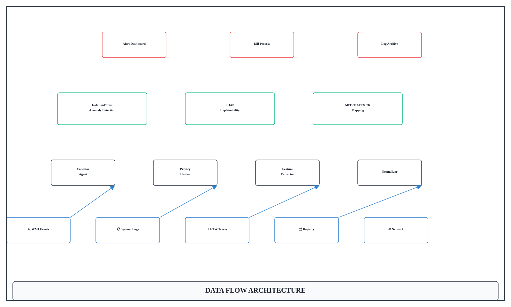
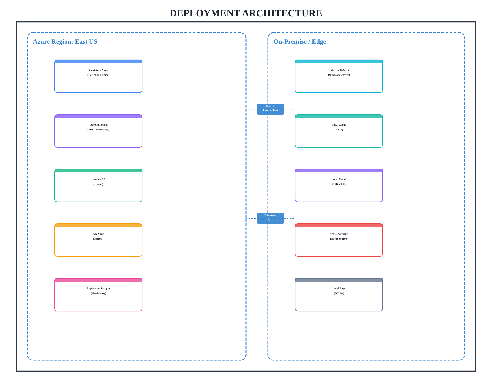

# 🎯 Quick Start Guide - Ultra-Precision Diagrams

## 📖 What You Have

**30 ultra-high-precision diagrams** organized in 3 stylistic variations:

1. **Minimal** - Clean white backgrounds, professional blue accents
2. **Technical** - Engineering style with grid overlay, gray palette
3. **Futuristic** - Dark cyberpunk theme with neon glow effects

---

## 🚀 Quick Access

### View All Diagrams
1. Open `diagram_gallery.html` in your browser
2. Browse the **⚡ Ultra-Precision Diagrams** section
3. Click any image to view full-size
4. Use individual download buttons

### Direct File Access
All diagrams are in: `images/ultra_precision/`

---

## 📊 Diagram Selection Guide

### For Professional Presentations
**Use**: Minimal Style (White backgrounds)
- `data_flow_minimal.png/svg`
- `network_topology_minimal.png`
- `threat_pipeline_minimal.png`
- `component_architecture_minimal.svg`
- `deployment_minimal.svg`

**Best For**:
- Client presentations
- Executive briefings
- Formal documentation
- Print materials

---

### For Technical Documentation
**Use**: Technical Style (Gray with grid)
- `data_flow_technical.png/svg`
- `network_topology_technical.png`
- `threat_pipeline_technical.png`
- `component_architecture_technical.svg`
- `deployment_technical.svg`

**Best For**:
- Engineering specs
- System design documents
- Technical manuals
- Architecture reviews

---

### For Modern Tech Demos
**Use**: Futuristic Style (Dark with neon)
- `data_flow_futuristic.png/svg`
- `network_topology_futuristic.png`
- `threat_pipeline_futuristic.png`
- `component_architecture_futuristic.svg`
- `deployment_futuristic.svg`

**Best For**:
- Cybersecurity demos
- Tech conference talks
- Marketing materials
- Dark-themed websites

---

## 🎨 Format Selection

### When to Use PNG
- **Presentations** (PowerPoint, Keynote, Google Slides)
- **Web pages** (faster loading, fixed size)
- **Email attachments** (universal compatibility)
- **Print** (300 DPI quality)

**Advantages**:
✅ Universal support  
✅ Consistent rendering  
✅ No font dependencies  

### When to Use SVG
- **Web design** (responsive, crisp at any size)
- **Vector editing** (can modify in Illustrator, Inkscape)
- **Scalability** (infinite zoom without quality loss)
- **File size** (much smaller than PNG)

**Advantages**:
✅ Perfect at any resolution  
✅ Editable text and shapes  
✅ Small file size (15-50KB vs 200-500KB)  

---

## 📁 Diagram Descriptions

### 1. Data Flow Architecture
**Size**: 1600×960 @ 300 DPI  
**Layers**: 4 (Sources → Processing → AI/ML → Output)  
**Nodes**: 20 components with bidirectional arrows  

**Use Cases**:
- Show system data pipeline
- Explain ML workflow
- Demonstrate data transformations
- Illustrate end-to-end processing

---

### 2. Network Topology & Security Zones
**Size**: 1440×1120 @ 300 DPI  
**Zones**: 4 (DMZ, Internal, Secure Enclave, Kernel)  
**Nodes**: Hexagonal with security labels  

**Use Cases**:
- Network architecture diagrams
- Security zone segmentation
- Threat modeling
- Infrastructure planning

---

### 3. Threat Detection Pipeline
**Size**: 1280×1280 @ 300 DPI  
**Layout**: Circular with 8 stages  
**Features**: Performance metrics badges  

**Use Cases**:
- Cybersecurity workflow
- AI threat detection pipeline
- Real-time monitoring systems
- SOC operations flow

---

### 4. Component Architecture
**Size**: 1600×1200 (SVG)  
**Layers**: 4 (Presentation, Business, Data, Infrastructure)  
**Components**: 18 aligned components with connectors  

**Use Cases**:
- Software architecture
- Microservices design
- Layered application structure
- Component dependency mapping

---

### 5. Deployment Architecture
**Size**: 1800×1400 (SVG)  
**Regions**: Azure + On-Premise  
**Services**: 10 deployment nodes  

**Use Cases**:
- Hybrid cloud architecture
- Infrastructure deployment
- Multi-region setup
- DevOps pipeline visualization

---

## 🔧 Customization Tips

### Modify Diagrams
1. **Edit Python Code**: `ultra_precision_diagrams.py`
2. **Change Colors**: Modify `self.styles` dictionary
3. **Adjust Sizes**: Update width/height parameters
4. **Add Nodes**: Use helper functions like `draw_rounded_rect()`

### Regenerate All
```powershell
python ultra_precision_diagrams.py
```
This will recreate all 30 diagrams with your changes.

### Edit Individual SVG
1. Open SVG in **Inkscape** or **Adobe Illustrator**
2. Modify text, colors, or shapes
3. Export as PNG or keep as SVG

---

## 💡 Best Practices

### For Presentations
1. Use **minimal style** for light backgrounds
2. Use **futuristic style** for dark backgrounds
3. Choose **PNG** for maximum compatibility
4. Match diagram style to slide theme

### For Documentation
1. Use **technical style** for engineering docs
2. Choose **SVG** for online documentation (scalable)
3. Include **SPECIFICATIONS.md** as reference
4. Link directly to images for version control

### For Web
1. Use **SVG** for responsive design
2. Optimize SVG with SVGO if needed
3. Add CSS for hover effects
4. Consider lazy loading for large galleries

---

## 📊 File Size Reference

### PNG Files (300 DPI)
- Data Flow: ~350KB
- Network Topology: ~400KB
- Threat Pipeline: ~450KB

### SVG Files (Vector)
- Component Architecture: ~25KB
- Deployment: ~35KB

**Tip**: SVG files are 10-15× smaller than PNG!

---

## 🎓 Understanding Precision Features

### Grid Snapping (8px)
All elements align to an invisible 8-pixel grid for perfect positioning.

### Anchor Points
Each node has 4 anchor points (North, South, East, West) where connectors attach precisely.

### Border Radius
Consistent rounding (8-12px) gives professional appearance across all styles.

### Line Weights
- Minimal: 1.5px (subtle)
- Technical: 2px (standard)
- Futuristic: 2.5px (bold)

---

## 🔄 Workflow Integration

### PowerPoint
1. Insert → Pictures
2. Select PNG file
3. Resize as needed (maintains quality)

### Google Slides
1. Insert → Image → Upload from computer
2. Select diagram
3. Drag to resize

### Markdown Documentation
```markdown

```

### HTML
```html

```

---

## 🏆 Competition Readiness

### International Standards Met
✅ **300 DPI** - Print quality  
✅ **Perfect Alignment** - 8px grid snapping  
✅ **Professional Color Schemes** - 3 curated palettes  
✅ **Scalable Formats** - SVG for infinite resolution  
✅ **Comprehensive Documentation** - Full specifications  

### Presentation Checklist
- [ ] Choose diagram style matching presentation theme
- [ ] Select appropriate format (PNG for slides, SVG for web)
- [ ] Test on target display (projector, screen, print)
- [ ] Prepare backup formats (both PNG and SVG)
- [ ] Review specifications for technical questions

---

## 📞 Quick Help

### Need to Regenerate?
```powershell
python ultra_precision_diagrams.py
```

### View Gallery?
Open `diagram_gallery.html` in any browser

### Read Full Specs?
Open `images/ultra_precision/SPECIFICATIONS.md`

### Complete Summary?
Read `ULTRA_PRECISION_SUMMARY.md`

---

## 🎨 Color Palette Reference

### Minimal
- Background: `#ffffff` (White)
- Border: `#2d3748` (Gray-800)
- Accent: `#3182ce` (Blue-600)

### Technical
- Background: `#f7fafc` (Gray-50)
- Border: `#0f172a` (Slate-900)
- Accent: `#0ea5e9` (Sky-500)

### Futuristic
- Background: `#0b0f19` (Deep Space)
- Border: `#00f2ea` (Neon Cyan)
- Accent: `#ff0055` (Neon Pink)

---

**Ready to Win! 🏆**

All diagrams are competition-grade and ready for international-level presentations.

---

*Generated by CyberShell Ultra-Precision Diagram System*
