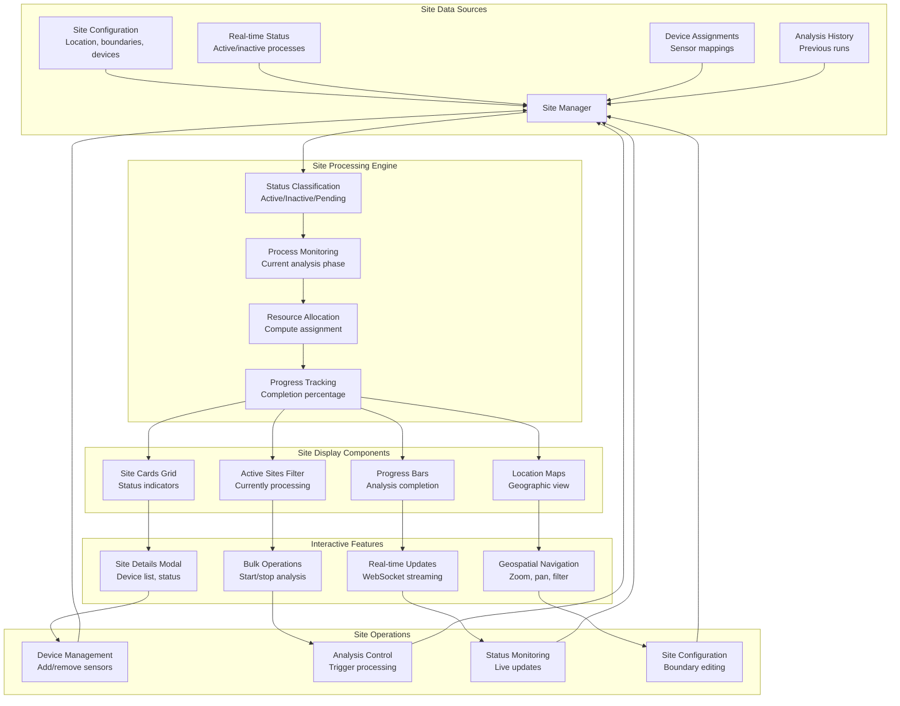
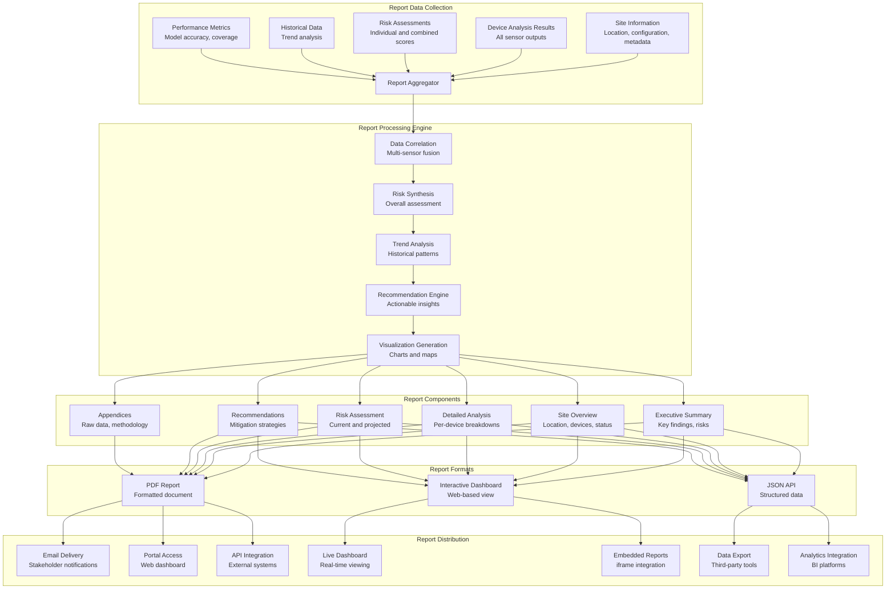
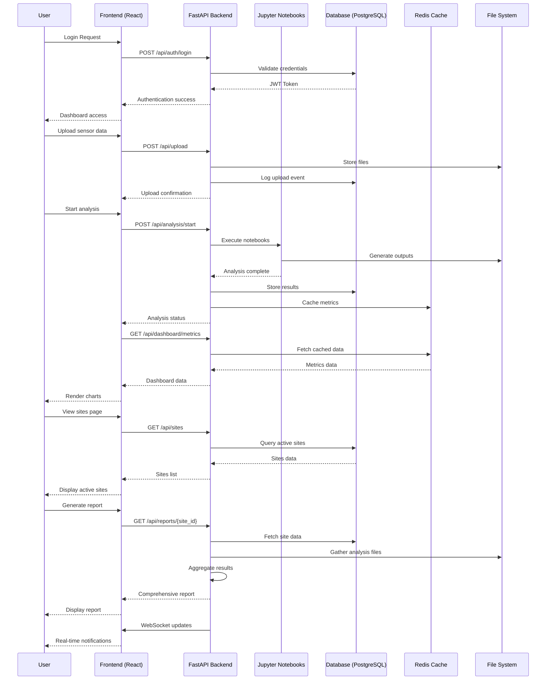
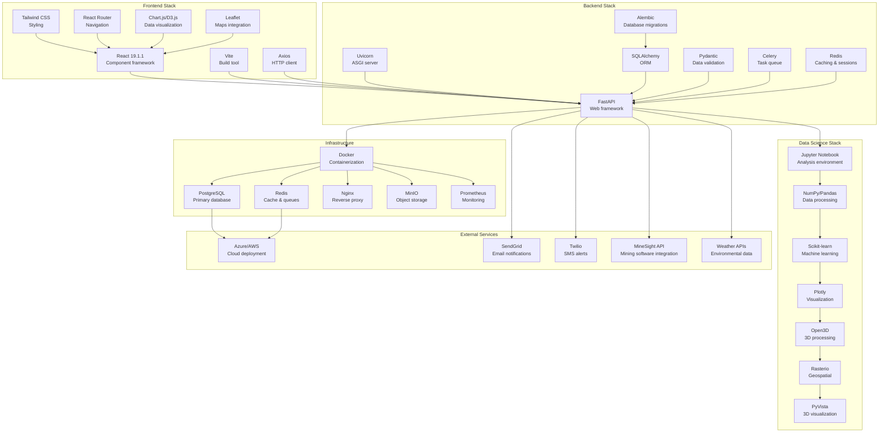
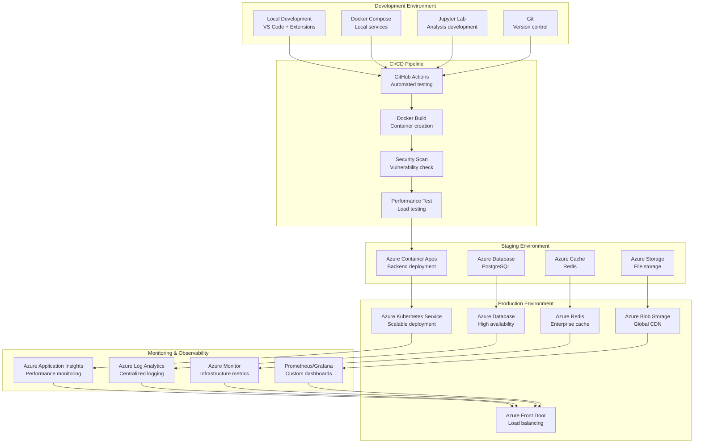

# AI Rockfall Prediction System - Complete Architecture Flow Chart

## System Overview Flow Chart

```mermaid
graph TB
    subgraph "Data Sources"
        A1[LiDAR .las files]
        A2[Geophone CSV data]
        A3[Piezometer sensor data]
        A4[GB-InSAR measurements]
        A5[Extensometer readings]
        A6[Weather station data]
        A7[YOLO image analysis]
        A8[Rockfall incident logs]
    end

    subgraph "Analysis Engine (Jupyter Notebooks)"
        B1[LiDAR_Rockfall_Prediction.ipynb<br/>- 3D point cloud processing<br/>- Feature extraction (38+ features)<br/>- K-means clustering<br/>- Random Forest/Gradient Boosting]
        B2[Geophone_Rockfall_Prediction.ipynb<br/>- Seismic signal processing<br/>- FFT frequency analysis<br/>- Magnitude calculation<br/>- Pattern recognition]
        B3[Piezometer_Landslide_Prediction.ipynb<br/>- Pressure monitoring<br/>- Time series analysis<br/>- Risk classification<br/>- Multi-class assessment]
        B4[GB_InSAR_Rockfall_Prediction.ipynb<br/>- Interferometric analysis<br/>- Ground deformation tracking<br/>- Velocity analysis<br/>- Risk mapping]
        B5[Extensometer_Analysis.ipynb<br/>- Crack opening analysis<br/>- Strain rate calculation<br/>- Stability assessment<br/>- Alert generation]
        B6[Automatic_Weather_Station_Analysis.ipynb<br/>- Environmental monitoring<br/>- Correlation analysis<br/>- Risk factor integration<br/>- Weather-based adjustments]
        B7[NewImageanalysis.ipynb<br/>- YOLOv8 object detection<br/>- Computer vision processing<br/>- Damage detection<br/>- Visual risk assessment]
    end

    subgraph "FastAPI Backend"
        C1[Data Ingestion API<br/>- File upload endpoints<br/>- Data validation<br/>- Format conversion]
        C2[Analysis Orchestration<br/>- Notebook execution<br/>- Parallel processing<br/>- Status tracking]
        C3[Results Aggregation<br/>- Multi-sensor fusion<br/>- Risk score calculation<br/>- Alert generation]
        C4[Database Layer<br/>- PostgreSQL integration<br/>- Historical data storage<br/>- Query optimization]
        C5[Real-time APIs<br/>- WebSocket connections<br/>- Live data streaming<br/>- Push notifications]
    end

    subgraph "Frontend Dashboard"
        D1[Authentication System<br/>- Login/Registration<br/>- JWT tokens<br/>- Role-based access]
        D2[Main Dashboard<br/>- Overall metrics<br/>- Risk heatmaps<br/>- Real-time alerts<br/>- Prediction charts]
        D3[Sites Management<br/>- Active sites display<br/>- Site status monitoring<br/>- Process tracking<br/>- Location mapping]
        D4[Device Management<br/>- Sensor configuration<br/>- Calibration status<br/>- Health monitoring<br/>- Maintenance alerts]
        D5[Reports & Analytics<br/>- Comprehensive reports<br/>- Multi-device analysis<br/>- Historical trends<br/>- Export functionality]
        D6[Prediction Interface<br/>- Real-time predictions<br/>- Risk visualization<br/>- Alert management<br/>- Decision support]
    end

    subgraph "Output Generation"
        E1[JSON Reports<br/>- Structured analysis results<br/>- Risk assessments<br/>- Performance metrics]
        E2[Visualization Files<br/>- 3D plots and heatmaps<br/>- Interactive dashboards<br/>- Risk maps]
        E3[CSV Logs<br/>- Trend analysis data<br/>- Historical tracking<br/>- Audit trails]
        E4[Raster Files<br/>- Geospatial risk maps<br/>- Coverage analysis<br/>- Spatial predictions]
    end

    subgraph "External Integrations"
        F1[Mining Control Systems<br/>- MineSight integration<br/>- Surpac connectivity<br/>- SCADA systems]
        F2[Cloud Services<br/>- Azure/AWS deployment<br/>- Data storage<br/>- Model serving]
        F3[IoT Networks<br/>- Real-time sensor feeds<br/>- Edge computing<br/>- Distributed processing]
        F4[Notification Systems<br/>- Email/SMS alerts<br/>- Emergency broadcasting<br/>- Stakeholder communication]
    end

    A1 --> B1
    A2 --> B2
    A3 --> B3
    A4 --> B4
    A5 --> B5
    A6 --> B6
    A7 --> B7
    A8 --> B1
    A8 --> B2
    A8 --> B3

    B1 --> C2
    B2 --> C2
    B3 --> C2
    B4 --> C2
    B5 --> C2
    B6 --> C2
    B7 --> C2

    C1 --> C2
    C2 --> C3
    C3 --> C4
    C4 --> C5

    C5 --> D1
    C5 --> D2
    C5 --> D3
    C5 --> D4
    C5 --> D5
    C5 --> D6

    C3 --> E1
    C3 --> E2
    C3 --> E3
    C3 --> E4

    D5 --> F1
    D5 --> F2
    C5 --> F3
    C3 --> F4
```

## Detailed Data Flow Architecture

```mermaid
graph LR
    subgraph "Input Processing"
        I1[Raw Sensor Data] --> I2[Data Validation]
        I2 --> I3[Format Standardization]
        I3 --> I4[Quality Assessment]
    end

    subgraph "Analysis Pipeline"
        I4 --> P1[Parallel Processing]
        P1 --> P2[Feature Engineering]
        P2 --> P3[ML Model Inference]
        P3 --> P4[Risk Calculation]
        P4 --> P5[Result Aggregation]
    end

    subgraph "Storage & Caching"
        P5 --> S1[Redis Cache<br/>Real-time data]
        P5 --> S2[PostgreSQL<br/>Historical data]
        P5 --> S3[File System<br/>Large datasets]
    end

    subgraph "API Layer"
        S1 --> A1[REST APIs<br/>CRUD operations]
        S2 --> A2[GraphQL APIs<br/>Complex queries]
        S3 --> A3[File APIs<br/>Download/upload]
        A1 --> A4[WebSocket<br/>Real-time updates]
        A2 --> A4
        A3 --> A4
    end

    subgraph "Frontend Consumption"
        A4 --> F1[Dashboard Widgets<br/>Metrics & KPIs]
        A4 --> F2[Interactive Charts<br/>D3.js/Chart.js]
        A4 --> F3[Maps Integration<br/>Leaflet/OpenLayers]
        A4 --> F4[Real-time Alerts<br/>Toast notifications]
    end

    subgraph "Business Logic"
        F1 --> B1[Risk Assessment Engine<br/>Multi-factor analysis]
        F2 --> B2[Trend Analysis<br/>Time series forecasting]
        F3 --> B3[Spatial Analysis<br/>GIS operations]
        F4 --> B4[Alert Management<br/>Escalation rules]
    end

    B1 --> O1[Decision Support<br/>Operational recommendations]
    B2 --> O2[Predictive Insights<br/>Future risk projections]
    B3 --> O3[Site Optimization<br/>Resource allocation]
    B4 --> O4[Emergency Response<br/>Actionable alerts]
```



## Dashboard Metrics Flow Chart

```mermaid
graph TD
    subgraph "Real-time Metrics"
        M1[Active Sites Count<br/>24 sites] --> D1[Dashboard Cards]
        M2[Online Devices<br/>187 devices] --> D1
        M3[Daily Predictions<br/>42 predictions] --> D1
        M4[Critical Alerts<br/>3 active] --> D1
    end

    subgraph "Risk Distribution Charts"
        R1[Risk Level Breakdown<br/>Low/Medium/High/Critical] --> C1[Pie Chart]
        R2[Site-wise Risk Scores<br/>Heatmap] --> C2[Geographic Map]
        R3[Temporal Risk Trends<br/>Time series] --> C3[Line Chart]
        R4[Device Health Status<br/>Status indicators] --> C4[Status Dashboard]
    end

    subgraph "Prediction Performance"
        P1[Model Accuracy<br/>94% LiDAR, 89% overall] --> PC1[Performance Cards]
        P2[False Positive Rate<br/>3.2%] --> PC1
        P3[Prediction Coverage<br/>87% of highwall] --> PC1
        P4[Response Time<br/>< 2 seconds] --> PC1
    end

    subgraph "Operational KPIs"
        K1[MTBF - Mean Time Between Failures<br/>45 days] --> KC1[KPI Dashboard]
        K2[Alert Response Time<br/>8 minutes avg] --> KC1
        K3[Prevented Incidents<br/>12 this quarter] --> KC1
        K4[Cost Savings<br/>$2.5M annually] --> KC1
    end

    D1 --> UI1[Main Dashboard Grid]
    C1 --> UI2[Charts Section]
    C2 --> UI2
    C3 --> UI2
    C4 --> UI2
    PC1 --> UI3[Performance Section]
    KC1 --> UI4[KPI Section]

    UI1 --> UX1[Responsive Layout<br/>Mobile/Desktop]
    UI2 --> UX1
    UI3 --> UX1
    UI4 --> UX1
```



## Sites Management Flow Chart



## Comprehensive Report Generation Flow Chart



## FastAPI Integration Architecture

```mermaid
graph TB
    subgraph "FastAPI Application"
        FA1[main.py<br/>Application entry point] --> FA2[API Router Configuration]
        FA2 --> FA3[CORS Middleware<br/>Frontend integration]
        FA3 --> FA4[Authentication Middleware<br/>JWT validation]
    end

    subgraph "API Endpoints"
        FA4 --> E1[POST /api/upload<br/>File upload endpoint]
        FA4 --> E2[GET /api/sites<br/>Sites listing]
        FA4 --> E3[GET /api/dashboard/metrics<br/>Dashboard data]
        FA4 --> E4[POST /api/analysis/start<br/>Trigger analysis]
        FA4 --> E5[GET /api/reports/{site_id}<br/>Report generation]
        FA4 --> E6[WebSocket /ws/updates<br/>Real-time updates]
    end

    subgraph "Business Logic Layer"
        E1 --> BL1[File Processing Service<br/>Validation, storage]
        E2 --> BL2[Site Management Service<br/>CRUD operations]
        E3 --> BL3[Metrics Calculation Service<br/>Aggregation logic]
        E4 --> BL4[Analysis Orchestration<br/>Notebook execution]
        E5 --> BL5[Report Generation Service<br/>PDF/JSON creation]
        E6 --> BL6[WebSocket Manager<br/>Real-time broadcasting]
    end

    subgraph "Data Access Layer"
        BL1 --> DA1[File System Handler<br/>Upload directory management]
        BL2 --> DA2[PostgreSQL Models<br/>Site, Device tables]
        BL3 --> DA3[Redis Cache<br/>Metrics caching]
        BL4 --> DA4[Jupyter Client<br/>Notebook execution]
        BL5 --> DA5[Template Engine<br/>Report formatting]
        BL6 --> DA6[WebSocket Connections<br/>Client management]
    end

    subgraph "External Dependencies"
        DA1 --> EX1[Local File System<br/>Data persistence]
        DA2 --> EX2[PostgreSQL Database<br/>Relational data]
        DA3 --> EX3[Redis Cache<br/>High-performance cache]
        DA4 --> EX4[Jupyter Kernel Gateway<br/>Analysis execution]
        DA5 --> EX5[Jinja2 Templates<br/>Report templates]
        DA6 --> EX6[WebSocket Protocol<br/>Real-time communication]
    end

    subgraph "Background Tasks"
        EX4 --> BT1[Celery Workers<br/>Async processing]
        BT1 --> BT2[Analysis Queue<br/>Job management]
        BT2 --> BT3[Result Processing<br/>Output handling]
        BT3 --> BT4[Notification Service<br/>Alert dispatching]
    end
```

## Complete System Integration Flow



## Technology Stack Integration



## Deployment Architecture



This comprehensive flow chart architecture provides a complete blueprint for the AI Rockfall Prediction System, incorporating FastAPI integration, enhanced dashboard with metrics and charts, sites management showing active processes, and comprehensive reporting combining all device analyses.</content>
<parameter name="filePath">c:\Users\rkste\Desktop\AI Rockfall Prediction\SYSTEM_ARCHITECTURE_FLOWCHART.md